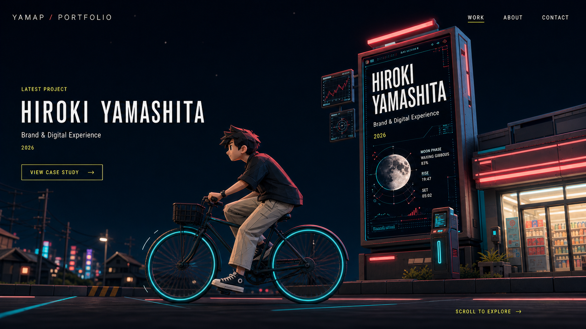
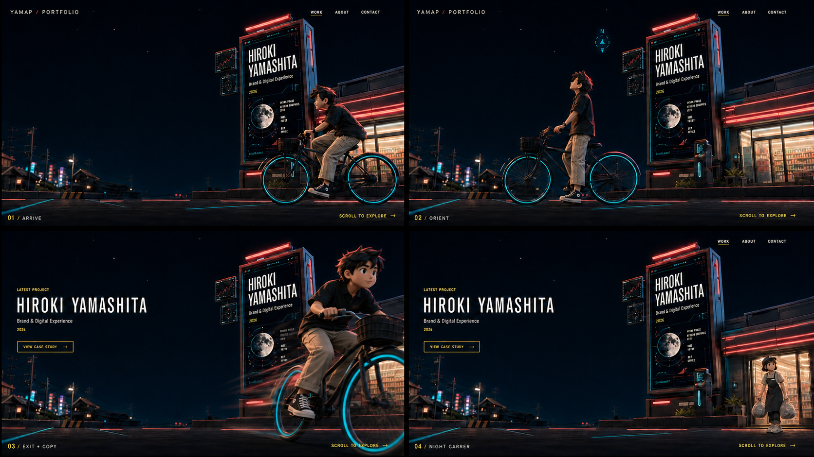
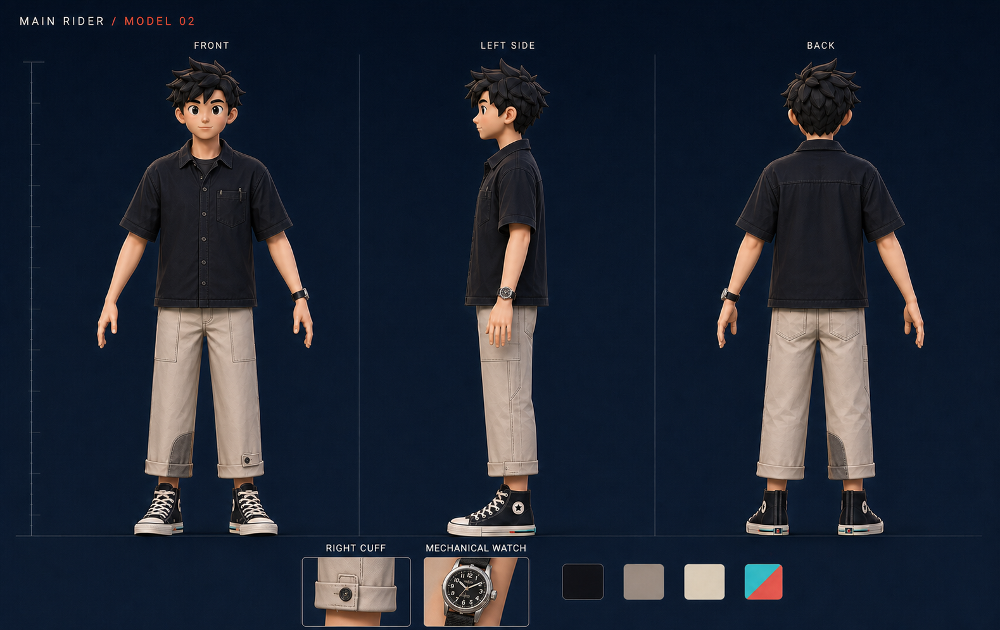
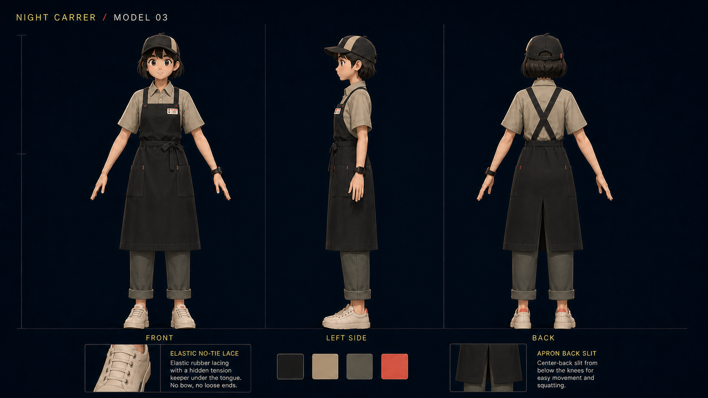

# Portfolio v2

[](https://github.com/i7s7-ymp/i7s7-ymp.github.io/actions)
[](https://astro.build/)
[](https://www.typescriptlang.org/)

主要経歴、コアスキル、個人活動・作品を、情報の理解しやすさと物語性の両方で伝える個人ポートフォリオです。

`portfolio_v2`では、現在の静的サイトを段階的に刷新します。舞台は2126年の夏の夜。現在の生活と技術が自然に延長された、可愛く、綺麗で、少しギークな近未来を描きます。

- Production: [https://i7s7-ymp.github.io](https://i7s7-ymp.github.io)
- Integration branch: `portfolio_v2`
- Status: design specification / implementation preparation

## Goals

V2の最優先事項は、デザインそのものではなく、訪問者が短時間で次の内容を理解できることです。

1. どのような経歴を持つ人物か
2. 何を得意とし、何を根拠にそう言えるか
3. どのような個人活動・作品を作っているか
4. 技術とデザインにどのような姿勢で向き合っているか

世界観や3D演出は、情報を隠す装飾ではなく、これらを記憶に残すための補助として扱います。

## Experience principles

- **Content first**: 経歴・スキル・作品を常に主役にする
- **Grounded future**: 現実の技術、生活、服装の延長として2126年を表現する
- **Cute, clean, geeky**: 可愛さ、清潔感、技術的な精密さを両立する
- **Progressive enhancement**: 静止画だけでも情報と操作が成立する
- **HTML first**: 見出し、本文、CTA、ナビゲーションを画像や動画へ焼き込まない
- **Motion with purpose**: 演出は一度再生したら停止し、閲覧と端末性能を妨げない
- **Evidence over labels**: スキル名だけでなく、成果・事例・判断材料を併記する

## Image boards

以下の画像を、V2の画角、色、ライティング、人物造形、モーション設計の基準とします。画像内の文字やUIをそのまま実装するのではなく、実際のサイトではHTMLとCSSによるアクセシブルな情報表示へ置き換えます。

### TOP hero



### Fixed-camera sequence



### Character model sheets

#### MAIN RIDER



#### NIGHT CARRER



## Information architecture

| Route      | Purpose                                    | Primary content                   |
| ---------- | ------------------------------------------ | --------------------------------- |
| `/`        | 世界観と人物像を提示し、主要情報へ導く     | Hero、要約、主要導線              |
| `/work`    | 個人活動・作品を魅力と根拠の両面から伝える | Selected work、case study         |
| `/about`   | 経歴と人物像を理解してもらう               | Experience、profile、values       |
| `/skills`  | 4つのコアスキルと説得材料を整理する        | Core skills、sub-skills、evidence |
| `/contact` | 連絡手段を迷わず選べるようにする           | Contact、social links             |

プロフィール回答AIは独立ページではなく、全ページから開けるポップアップとして実装する予定です。AIはコンテンツを代替せず、既に掲載されている情報へ案内する補助役とします。

## TOP hero

### Scene

夏の夜のコンビニ前を、固定カメラで捉えたワンシーンです。背景、看板、人物、UIは同じ画角を共有します。

1. 少年が画面右から自転車で登場する
2. 少年が空を見上げ、古典的な方位確認を行う
3. 少年が切り返し、カメラへ近づきながら右下へ退出する
4. 03で左側にポートフォリオ情報を表示する
5. コンビニからNIGHT CARRERがゴミ捨てに出てくる
6. 最終状態でアニメーションを停止する

ヘッダーとナビゲーションは常時HTMLで表示します。左側のプロジェクト情報は03以降に表示し、04でも維持します。

### Characters

#### MAIN RIDER

未来技術を理解した上で、修理可能で構造を把握できる古典技術を好むテック少年です。

- 機械式腕時計
- 通常の結ぶ靴紐
- ボタン式の右裾ストラップ
- 修理可能な縫製と最小限のデバイス
- クラシックな機械構造を残した自転車

#### NIGHT CARRER

少年と同年代。流行に影響されやすい文系タイプですが、仕事には真面目に取り組みます。

- 低彩度のカーキ、チャコール、エクリュ
- 整った仕事着と実用的なロングエプロン
- 背面スリット
- 交換可能なゴム製ノータイ靴紐
- 技術を意識せず、普及品として自然に利用する

## Rendering strategy

Heroはフルリアルタイム3Dにも、全面プリレンダー動画にも寄せません。固定カメラを活かしたハイブリッド構成を採用します。

```text
HTML / CSS
  Navigation, portfolio copy, CTA

Foreground alpha layer
  Curb, door frame, billboard base

Transparent realtime 3D canvas
  Characters, bicycle, door, trash bags, contact shadows

Pre-rendered background plate
  Store, interior, road, residential area, sky, lighting
```

### Runtime tiers

| Tier                        | Experience                            |
| --------------------------- | ------------------------------------- |
| High                        | 静止背景 + リアルタイム3Dキャラクター |
| Standard / mobile           | 端末別にレンダリングした短い動画      |
| Reduced motion / data saver | 最終状態の静止画                      |

初期表示では背景posterとHTMLを先に描画し、3DコードとGLBはLCP後に遅延読み込みします。リアルタイムアニメーションは一度だけ再生し、最終状態でレンダーループを停止します。

## Technology

### Current

- Astro 5
- TypeScript
- Tailwind CSS
- YAML content
- Static export
- GitHub Pages / GitHub Actions

### Planned for v2

- Three.js with a WebGL 2 production baseline
- glTF / GLB character assets
- Meshopt geometry compression
- KTX2 / Basis Universal texture compression
- AVIF / WebP background plates
- WebM / MP4 fallback video
- HTML/CSS overlay for readable and accessible content
- `prefers-reduced-motion` and data-saving fallbacks
- Optional scene breakdown for inspecting camera, wireframe and LOD

WebGPUはHeroの必須条件にしません。技術デモとして導入する場合も、WebGL 2または静止画へフォールバックできる構成にします。

## Performance budget

数値は実装と実機計測を通して更新します。

| Metric                       |                     Target |
| ---------------------------- | -------------------------: |
| LCP                          |           `<= 2.5s` at p75 |
| INP                          |          `<= 200ms` at p75 |
| CLS                          |            `<= 0.1` at p75 |
| Initial Hero poster          |                 `<= 500KB` |
| Deferred 3D assets / desktop |                   `<= 6MB` |
| Deferred 3D assets / mobile  |                   `<= 3MB` |
| Visible triangles            |                  `<= 120k` |
| Draw calls                   |                    `<= 50` |
| Canvas DPR                   |                  `1.0–1.5` |
| Mobile animation             | stable `30fps` or fallback |

Performance rules:

- 3Dライブラリを初期JavaScriptへ含めない
- Hero領域が非表示になったらレンダリングを停止する
- タブが非表示になったらアニメーションを停止する
- レイアウト寸法を先に確保し、読み込み後の移動を発生させない
- MobileはDesktopの単純な切り抜きではなく、専用カメラとLODを使用する
- 品質よりフレーム安定性を優先し、端末に応じて解像度を下げる

## Asset plan

### Environment

- [ ] Desktop background plate
- [ ] Tablet background plate
- [ ] Mobile background plate
- [ ] Foreground occlusion mask
- [ ] Store exterior shell
- [ ] Shallow interior shelf set
- [ ] Billboard and display surface
- [ ] Automatic door
- [ ] Road, curb and contact-shadow plane
- [ ] Distant residential matte

### Characters and props

- [x] MAIN RIDER design / three-view sheet
- [x] NIGHT CARRER design / three-view sheet
- [ ] MAIN RIDER production model and rig
- [ ] NIGHT CARRER production model and rig
- [ ] Bicycle model and rig
- [ ] Trash bag props
- [ ] Direction-checking prop
- [ ] LOD variants

### Motion

- [x] Hero sequence and fixed-camera direction
- [ ] Timing animatic
- [ ] Rider enter / orient / turn / diagonal exit clips
- [ ] Night Carrer door / walk / glance clips
- [ ] Door, wheels, hair, clothing and trash-bag secondary motion
- [ ] Reduced-motion still state

## Repository

```text
src/
  components/       Astro components
  data/             YAML content
  layouts/          Shared layouts
  pages/            Routes
  scripts/client/   Client-side behavior
  styles/           Tokens and shared styles
public/
  images/           Optimized 2D assets
  models/           Compressed GLB assets
  textures/         KTX2 and environment textures
  videos/           Device-specific fallback video
docs/               Architecture, design and operation docs
tests/visual/       Playwright visual regression tests
```

Asset directories listed above will be added only when the corresponding production assets exist. Placeholder binaries are not committed.

## Development

Requirements:

- Node.js 18+
- npm
- Git

```bash
git clone https://github.com/i7s7-ymp/i7s7-ymp.github.io.git
cd i7s7-ymp.github.io
git switch portfolio_v2
npm install
npm run dev
```

Open [http://localhost:3000](http://localhost:3000).

### Commands

```bash
npm run dev          # Local development server
npm run type-check   # Astro sync + TypeScript
npm run lint         # ESLint
npm run format:check # Prettier check
npm run build        # Production build
npm run check        # Type check + lint + format
npm run test:visual  # Playwright visual regression
```

## Branch workflow

| Branch         | Role                                           |
| -------------- | ---------------------------------------------- |
| `main`         | 現行Production。マージでGitHub Pagesへデプロイ |
| `portfolio_v2` | V2の統合ベースブランチ                         |
| `feat/v2-*`    | V2機能を分割して実装する作業ブランチ           |
| `fix/v2-*`     | V2固有の修正ブランチ                           |
| `docs/v2-*`    | V2ドキュメント更新                             |

V2が公開条件を満たすまで、`main`は現行サイトとして維持します。

## Roadmap

### Phase 0 — Foundation

- [x] `portfolio_v2`ベースブランチ
- [x] V2 README
- [ ] ADRとアセット命名規則
- [ ] ページ構成とコンテンツスキーマ

### Phase 1 — Content-first UI

- [ ] V2デザイントークン
- [ ] Header / navigation
- [ ] Work / About / Skills / Contactの静的実装
- [ ] 経歴・スキル・作品データの移行
- [ ] AIチャットのポップアップ化

### Phase 2 — Static Hero

- [ ] レスポンシブ背景画像
- [ ] 固定カメラ構図
- [ ] 03で表示されるHTMLコピー
- [ ] 静止画だけで成立するフォールバック

### Phase 3 — Realtime characters

- [ ] 3Dアセットパイプライン
- [ ] 透明Canvas合成
- [ ] 遮蔽マスクと接地影
- [ ] Heroシーケンス
- [ ] 動画フォールバック

### Phase 4 — Quality

- [ ] 実機別LODと動的解像度
- [ ] Core Web Vitals計測
- [ ] アクセシビリティ監査
- [ ] Visual regression
- [ ] Cross-browser verification

### Phase 5 — Release

- [ ] コンテンツ最終確認
- [ ] Production asset audit
- [ ] `portfolio_v2`から`main`への移行計画
- [ ] Release and post-release monitoring

## Definition of done

- 3Dまたは動画を読み込めなくても主要情報と全導線を利用できる
- HeroコピーがHTMLとして読み上げ・選択・検索できる
- Keyboardのみで主要ページとAIチャットを操作できる
- `prefers-reduced-motion`で不要な移動が停止する
- MobileとDesktopの両方でCore Web Vitals目標を満たす
- 主要経歴、4つのコアスキル、個人活動作品が3クリック以内に到達できる
- `npm run check`とProduction buildが成功する
- UI変更にVisual regressionまたは確認用スクリーンショットがある

## Documentation

- [Architecture](docs/architecture.md)
- [Design system](docs/design-system.md)
- [Testing](docs/testing.md)
- [Runbook](docs/runbook.md)
- [Contributing](docs/contributing.md)

既存ドキュメントは現行サイトを説明しています。V2実装に合わせて段階的に更新します。

## License

[MIT](LICENSE)
