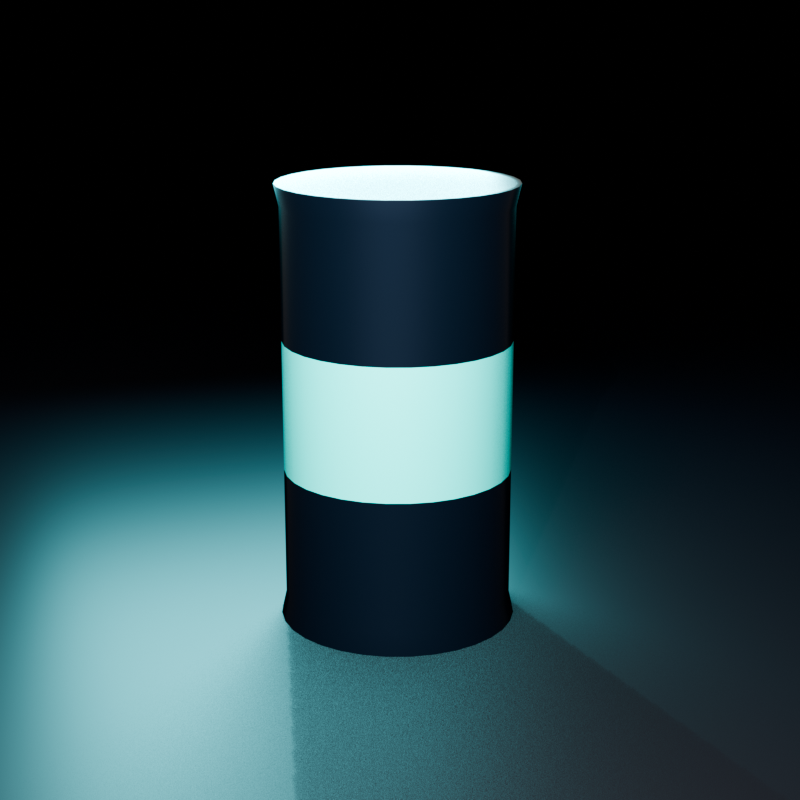

# 2126年の缶飲料 — Stage 01

制作日: 2026-09-03  
Blender: 5.2.0 LTS

## 目的

Blenderの基本操作から始め、実寸に近い缶飲料を題材に、非破壊モデリング、マテリアル、照明、カメラ、EEVEEレンダリングまでを一通り学ぶ。

## 成果物

- `future-can-stage01.blend`: 編集可能な学習マイルストーン
- `preview.png`: EEVEEによる800×800 pxの最終プレビュー

## 学んだ操作

- 3Dビューポートの移動、回転、ズーム
- オブジェクトモードと編集モードの違い
- `G / R / S`による移動、回転、拡縮
- Primitiveの追加、複製、命名、Collection整理
- `H / Alt+H / X / Command+Z`による非表示、再表示、削除、復元
- スケールの適用と、メッシュ寸法・オブジェクト変換の違い
- Inset、Extrude、Loop Cutによるリムとラベル帯の作成
- BevelとSmooth by Angleを使った非破壊な形状・陰影調整
- マテリアルスロットによる面単位の塗り分け
- カメラ、床、キーライト、リムライトの配置
- AgXと露出調整を含むEEVEEレンダリング

## 構成

### オブジェクト

- `CAN_BODY`
- `STUDIO_FLOOR`
- `PRODUCT_CAMERA`
- `KEY_LIGHT`
- `RIM_LIGHT`

### マテリアル

- `MAT_CAN_NAVY`
- `MAT_ALUMINUM`
- `MAT_LABEL_CYAN`
- `MAT_STUDIO_FLOOR`

### モディファイアー

`CAN_BODY`には次の順序で設定している。

1. `Bevel`
2. `Smooth by Angle`

モディファイアーは適用せず、後から数値を調整できる状態を保持した。

## 制作中に解決したこと

- 「テンキーを模倣」が有効な環境では数字キーが視点操作になるため、頂点・辺・面の選択はヘッダーのアイコンを使用した。
- 初回レンダーではキーライトとリムライトが強く、ラベルとアルミ面が白飛びした。
- ライト出力を下げ、面積を広げ、ラベルのメタリックを外し、AgXの露出を調整して色と形状を読みやすくした。

## 合格条件

- [x] シルエットが缶として成立している
- [x] スケールを適用する理由を説明できる
- [x] Bevelの役割を説明できる
- [x] ハイライトが極端に途切れない
- [x] 単純な照明とカメラで1枚レンダリングできる
- [x] 作業ファイル、プレビュー、学習記録を分離して保存した

## 次回以降に追加できる要素

- プルタブと飲み口
- UV展開と画像ラベル
- 缶底のより正確な形状
- Web向けGLBの軽量化と実機検証

これらはStage 01の合格条件には含めず、将来プロダクション用アセットへ発展させる際の課題とする。
